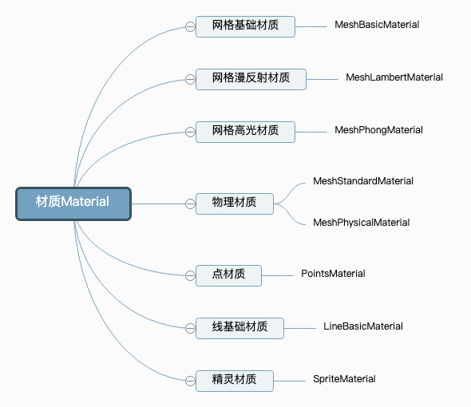

# 文档1

Three.js、WebGL、Canvas三者是什么及它们之间的关系：

## 什么是 Canvas？

Canvas 是 HTML5 中新增的元素，用于绘制图形和图像。它提供了一个 2D 绘图上下文，可以用来绘制各种形状、线条、文字和图像。已经被广泛应用于游戏开发、图像编辑、数据可视化、动画制作等领域。

## 什么是 WebGL？

WebGL（Web 图形库）是一种 JavaScript API，用于在任何兼容的 Web 浏览器中呈现交互式 3D 和 2D 图形，而无需使用插件。WebGL 通过引入一个与 OpenGL ES 2.0 紧密相符合的 API，可以在 HTML5 `<canvas>`元素中使用（简介引自 MDN）。

以我的理解，WebGL 给我们提供了一系列的图形接口，能够让我们通过 JavaScript 去使用 GPU 来进行浏览器图形渲染的工具。

## 什么是 Three.js？

Three.js 在 WebGL 的 API 接口基础上，又进行的一层封装。Three.js 以简单、直观的方式封装了 3D 图形编程中常用的对象。Three.js 在开发中使用了很多图形引擎的高级技巧，极大地提高了性能。

## 创建立方体及外观

### 物体外观：Material



```js
//创建一个材质对象Material
const material = new THREE.MeshBasicMaterial({
    color: 0xff0000,//0xff0000设置材质颜色为红色
}); 
```

颜色设置可以有3种格式：

- 'red'
- 0xff0000
- #ff0000

作者：smile唯心

链接：<https://juejin.cn/post/7341239784734048297>

来源：稀土掘金
